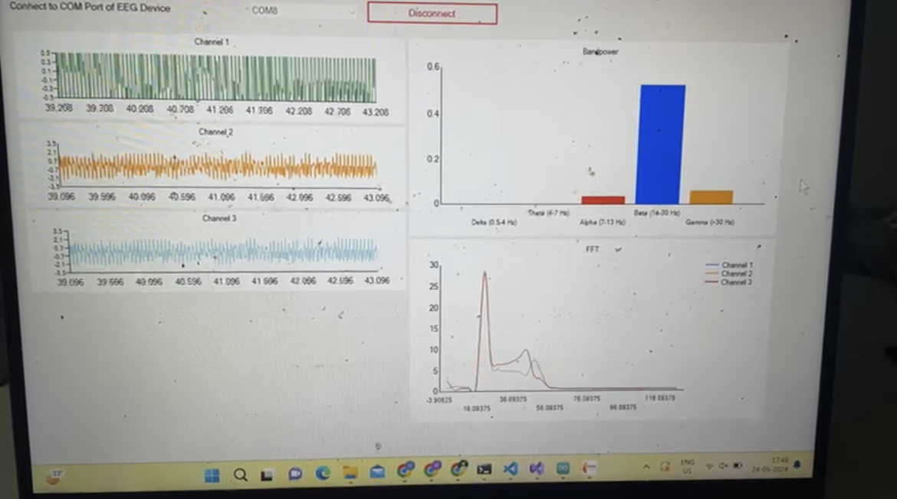

# ECG Acquizition and Visualization System
This is a ECG Acquizition system based on STM32 and AD8232. The acquired signals are transmitted to the host system where the software in the GUI can be used for vizualization and signal processing. The signal has been detrended to eliminate linear trends and notch filter has been applied at 50 Hz to remove powerline interference. Further, a highpass filter is applied to reduce the DC offset. Lead off detection has been done as well. 

## Steps to setup:
- Install STM32CubeIDE.
- Connect as follows:

PA0->OUTPUT 
3v3->3v3 
GND->GND 
PA5->SDN 
PA3 -> LO- 
PA4 -> LO+  

- Build and flash the firmware to your STM32 board. I used a STM32F030 Nucleo board.
- Run the GUI software and see the ECG signal!

## Using your own GUI
- Build the GUI using your favorite framework/library.
- Write code for serial communication.
- If the sent data is a character "M", lead-off event has occurred which yo can handle in the GUI.
- If a numeric value is received convert it to float using the ADC conversion formula. Process the signal using libraries like brainflow, scipy, etc.
- Display the results on a graph! 

